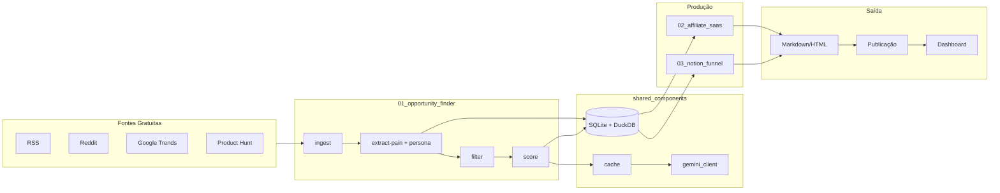
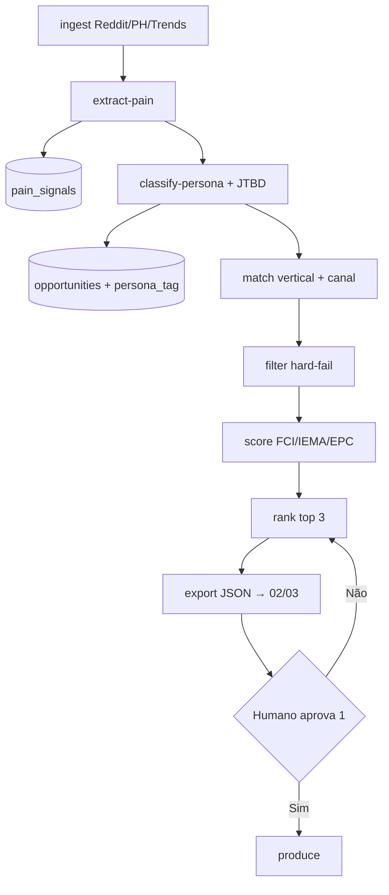
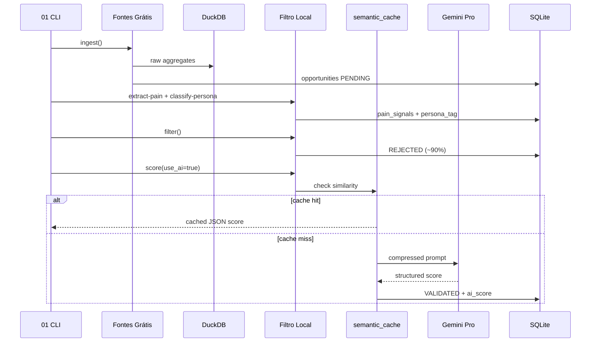
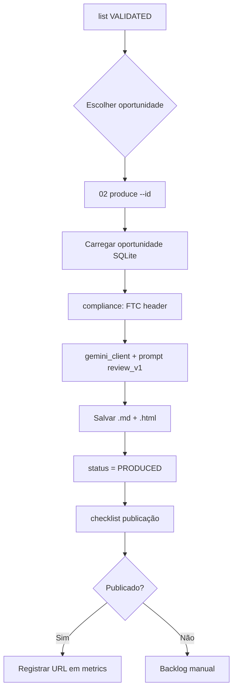
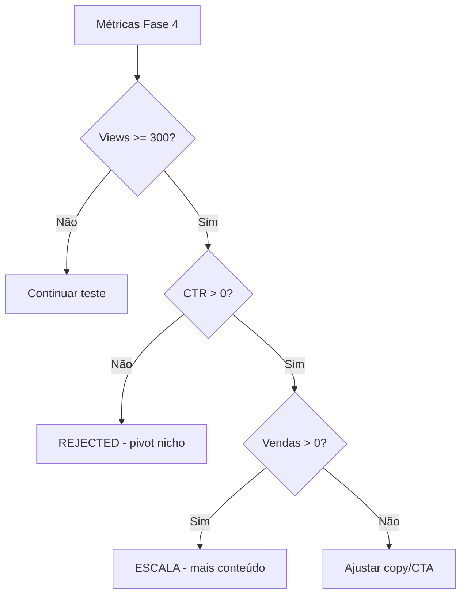

# 🔄 Fluxos Operacionais

> Diagramas e sequências para implementação pelo Cursor.

**Referências:** [Arquitetura](./02-architecture.md) · [Módulos](./03-modules.md)

---

## 📑 Sumário

1. [Fluxo Macro do Ecossistema](#-fluxo-macro-do-ecossistema)
2. [Fluxo Audience Intelligence](#-fluxo-audience-intelligence)
3. [Fluxo de Pesquisa e Validação](#-fluxo-de-pesquisa-e-validação)
3. [Fluxo de Produção SaaS](#-fluxo-de-produção-saas)
4. [Fluxo de Decisão (Pivot)](#-fluxo-de-decisão-pivot)
5. [Fluxo de Chamada IA](#-fluxo-de-chamada-ia)

---

## 🌐 Fluxo Macro do Ecossistema



---

## 🎯 Fluxo Audience Intelligence

> Camada entre ingest e validação — [15-audience-intelligence](./15-audience-intelligence.md)



### Ciclo 3× por semana (`weekly-cycle`)

| Dia | Ação |
|-----|------|
| Segunda 08:00 | `weekly-cycle` → top 3 |
| Quarta 08:00 | `weekly-cycle` → top 3 |
| Sexta 08:00 | `weekly-cycle` + relatório persona/EPC |

---

## 🔍 Fluxo de Pesquisa e Validação



### Hard-fail filters (sem IA)

| Regra | Ação |
|-------|------|
| `search_volume < 1000` | REJECTED |
| `competition_score > 50` | REJECTED |
| Duplicata (mesmo keyword+source) | SKIP |
| Fonte indisponível | LOG + retry manual |

---

## 💼 Fluxo de Produção SaaS



---

## 🔀 Fluxo de Decisão (Pivot)



Ver thresholds completos em [13-metrics.md](./13-metrics.md).

---

## 🤖 Fluxo de Chamada IA

```
Request
  → hash_cache (MD5, TTL 7d) ──hit──→ Return
  → semantic_cache (cosine > 0.96) ──hit──→ Return
  → compress_context()
  → gemini.generate(structured_output=PydanticModel)
  → persist both caches
  → Return
```

**Proibido:** bypass direto ao Gemini sem passar por este fluxo.

---

*Última atualização: julho/2026*
