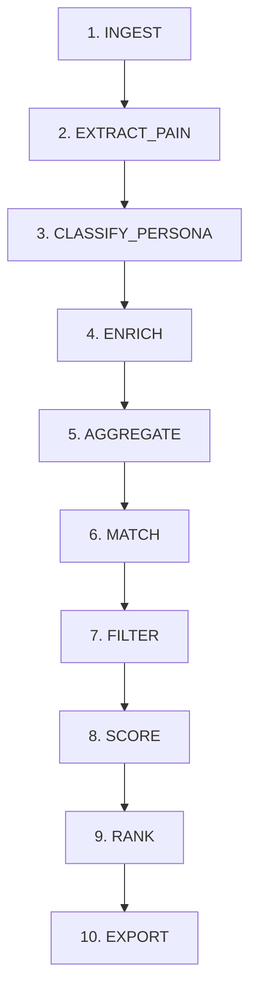

# 🎯 Audience Intelligence — Persona, Dor e Job-to-be-Done

> Camada estratégica entre **Pesquisa** e **Validação** que transforma dados brutos em decisões de público, nicho e canal para o **mercado internacional (USD / inglês)**.

**Referências:** [Visão](./00-vision.md) · [APIs e Enriquecimento](./06-apis.md) · [Banco](./05-database.md) · [Automação](./14-deploy.md) · [Riscos](./12-risks.md)

---

## 📑 Sumário

1. [Por Que Esta Camada Existe](#-por-que-esta-camada-existe)
2. [Pipeline Formal — Contratos por Estágio](#-pipeline-formal--contratos-por-estágio)
3. [Persona — Especificação Formal](#-persona--especificação-formal)
4. [Dor (Pain) — Especificação Formal](#-dor-pain--especificação-formal)
5. [Job-to-be-Done (JTBD)](#-job-to-be-done-jtbd)
6. [Match Dor → Vertical → Canal](#-match-dor--vertical--canal)
7. [Comportamento Humano = Heurísticas de Decisão](#-comportamento-humano--heurísticas-de-decisão)
8. [Usar Vieses a Favor — Sem Riscos ao Negócio](#-usar-vieses-a-favor--sem-riscos-ao-negócio)
9. [Ciclo Automatizado 3× por Semana](#-ciclo-automatizado-3-por-semana)
10. [O Que Automatizar vs. Humano](#-o-que-automatizar-vs-humano)
11. [Definition of Done — “Completo o Suficiente”](#-definition-of-done--completo-o-suficiente)
12. [Integração com Módulo 01](#-integração-com-módulo-01)

---

## 💡 Por Que Esta Camada Existe

A multidão de afiliados escolhe **um produto** e promove. O RE-IA escolhe **para quem**, **qual dor** e **qual canal** — depois o produto.

| Abordagem comum | RE-IA com Audience Intelligence |
|-----------------|--------------------------------|
| "Este template é bonito" | "Freelancers com caos de clientes buscam CRM Notion" |
| Comissão % alta | EPC + dor urgente + persona com hábito de pagar em USD |
| Mesmo funil para tudo | Canal por vertical e cookie (Pinterest vs YouTube) |
| Abandona tarde | Pivot com regra após N views/cliques |
| Fontes em português | **Mercado internacional:** Reddit EN, Trends US, PH global |

Sem esta camada, o `01_opportunity_finder` ranqueia **keywords**; com ela, ranqueia **oportunidades para um público específico com dor mensurável**.

---

## 🔄 Pipeline Formal — Contratos por Estágio

Cada estágio tem **entrada**, **processamento**, **saída** e **ferramentas** (detalhes de enriquecimento em [06-apis](./06-apis.md#-matriz-de-enriquecimento-campo--ferramenta--método)).



| # | Estágio | Entrada | Processamento | Saída (SQLite/DuckDB) | Gemini? |
|---|---------|---------|---------------|----------------------|---------|
| 1 | **INGEST** | APIs/RSS públicas EN | Normalizar `raw_data` JSON | `opportunities` PENDING, `raw_ingest` | ❌ |
| 2 | **EXTRACT_PAIN** | `raw_data`, comentários Reddit/PH | Regex + engagement | `pain_signals` | ❌ |
| 3 | **CLASSIFY_PERSONA** | `pain_signals` + subreddit/contexto | Regras + embeddings locais | `persona_tag`, `persona_confidence` | ❌ |
| 4 | **ENRICH** | keyword + vertical | Trends, Autosuggest, pain merge | `search_volume`, `pain_statement`, `jtbd_statement` | ⚠️ opcional JTBD |
| 5 | **AGGREGATE** | registros enriquecidos | DuckDB: dor por persona | `pain_by_persona` view | ❌ |
| 6 | **MATCH** | persona + pain_category | Heurísticas playbook | `vertical`, `suggested_channel` | ❌ |
| 7 | **FILTER** | oportunidades enriquecidas | Hard-fail + heurísticas | REJECTED ou continua | ❌ |
| 8 | **SCORE** | sobreviventes | FCI/IEMA/EPC + `intent_score` | scores numéricos | ⚠️ top N apenas |
| 9 | **RANK** | VALIDATED candidates | `pain_urgency × intent × framework` | ordenação top 3 | ❌ |
| 10 | **EXPORT** | top 3 | JSON handoff | arquivo `output/weekly_*.json` | ❌ |

**Comando único:** `weekly-cycle` executa estágios 1→10 em sequência — ver [14-deploy](./14-deploy.md).

---

## 👤 Persona — Especificação Formal

### Definição

**Persona** no RE-IA não é um avatar de marketing — é uma **tag enumerada** derivada de sinais observáveis em fontes públicas em inglês, com **confiança** e **rastreabilidade**.

### Taxonomia canônica (`persona_tag`)

| Tag | Definição operacional | Mercado USD | Verticais | Canais |
|-----|----------------------|-------------|-----------|--------|
| `freelancer` | Profissional solo que vende serviço | US/UK/CA/AU | template, saas | Pinterest, Medium |
| `agency_smb` | Agência 2–15 pessoas | US/EU SMB | saas, template | LinkedIn, Medium |
| `developer` | Dev, no-code, indie hacker | Global tech EN | saas, digital | YouTube, Reddit, HN |
| `corporate_junior` | Analista/coordenador em empresa | US corporate | saas, template | LinkedIn, Medium |
| `creator` | Creator, POD, Etsy seller | US creator economy | digital, template | Pinterest, TikTok |
| `home_consumer` | Consumidor final, casa/hobbies | US retail | physical, template | Pinterest, Amazon |
| `student` | Carreira, portfólio, ATS | US students/new grad | digital, template | Pinterest, LinkedIn |
| `unknown` | Sinais insuficientes | — | — | requer mais ingest |

### Campos no schema

| Campo | Tipo | Obrigatório | Descrição |
|-------|------|-------------|-----------|
| `persona_tag` | TEXT | após estágio 3 | Uma tag da taxonomia |
| `persona_confidence` | REAL 0–1 | após estágio 3 | Confiança da classificação |
| `persona_signals` | TEXT (JSON) | opcional | Lista de sinais que levaram à tag |

### Regras de classificação (determinísticas)

```yaml
# config/persona_rules.yaml (sugestão)
rules:
  - match:
      subreddit_in: [freelance, Upwork, smallbusiness]
      text_contains: ["my clients", "client portal", "proposal"]
    persona: freelancer
    confidence: 0.85
  - match:
      subreddit_in: [cursor, SaaS, webdev, ExperiencedDevs]
    persona: developer
    confidence: 0.80
  - match:
      text_contains: ["resume", "ATS", "job application", "cover letter"]
    persona: student
    confidence: 0.75
```

**Desempate:** se duas personas ≥ 0.7 → escolher maior confidence; se empate → `unknown` + flag `manual_review`.

### Como enriquecer `persona_tag`

| Fonte | Método | Campo alimentado |
|-------|--------|------------------|
| Reddit `.json` | subreddit + título/corpo | `persona_tag`, `persona_confidence` |
| Product Hunt comments | linguagem B2B vs indie | `agency_smb` vs `developer` |
| Google Autosuggest | sufixo profissão (`for freelancers`) | confirmação persona |
| Embeddings locais | similaridade com exemplos por tag | boost confidence +0.1 |

Matriz completa: [06-apis — Enriquecimento](./06-apis.md#-matriz-de-enriquecimento-campo--ferramenta--método).

---

## 🩹 Dor (Pain) — Especificação Formal

### Definição

**Dor** é uma **declaração em linguagem natural** (inglês) extraída de fontes públicas, categorizada e pontuada por **urgência social** — não é opinião do operador.

### Taxonomia (`pain_category`)

| Categoria | Definição | Padrões regex (EN) | Vertical |
|-----------|-----------|-------------------|----------|
| `time_waste` | Perda recorrente de tempo | `wasting hours`, `every week I`, `manual process` | template, saas |
| `money_risk` | Perda financeira ou subprecificação | `losing money`, `undercharge`, `pricing clients` | template, saas |
| `organization` | Caos informacional | `messy`, `chaos`, `can't find`, `scattered` | template |
| `blank_canvas` | Paralisia por início | `don't know where to start`, `empty page`, `from scratch` | digital, template |
| `tool_friction` | Ferramenta inadequada | `alternative to`, `doesn't have`, `missing feature` | saas |
| `physical_pain` | Desconforto físico/ambiente | `back pain`, `cable mess`, `desk setup`, `ergonomic` | physical |
| `social_proof_gap` | Incerteza na escolha | `worth it`, `anyone tried`, `is X good for` | todas |

### Campos no schema

| Campo | Tipo | Origem |
|-------|------|--------|
| `pain_statement` | TEXT | Frase representativa do cluster (≤ 200 chars) |
| `pain_category` | TEXT | Taxonomia acima |
| `pain_urgency_score` | REAL 0–1 | `0.25` se engagement ≥ 30; + heurísticas |
| `pain_signals` (tabela) | rows | Sinais brutos antes do merge |

### Objeto formal `PainSignal` (Pydantic)

```python
class PainSignal(BaseModel):
    source: Literal["reddit", "producthunt", "hackernews", "rss"]
    source_url: str
    raw_text: str
    pain_category: str | None = None
    persona_hint: str | None = None
    engagement_score: int = 0      # upvotes + comments
    language: str = "en"           # filtrar não-EN no MVP
    extracted_at: datetime
```

### Regras de extração

```
# Padrões prioritários (case-insensitive)
is there a template for
how can I connect
alternative to
worth it
unpopular opinion: .* lacks
frustrated with
anyone else struggle with
looking for a .* that
```

| Regra | Efeito |
|-------|--------|
| `engagement_score ≥ 30` | `pain_urgency_score += 0.25` |
| ≥ 3 sinais mesma categoria + persona | merge → `pain_statement` |
| Texto não-inglês detectado | descartar no MVP (foco USD) |
| Spam/cupom detectado | não extrair dor |

### Como enriquecer `pain_statement`

1. Agrupar `pain_signals` por `(persona_hint, pain_category)` via embeddings locais.
2. Escolher texto com maior `engagement_score` como `pain_statement`.
3. Se cluster ≥ 5 sinais → opcional: Gemini resume em 1 frase JTBD-ready (1 call/cluster).

---

## 🛠️ Job-to-be-Done (JTBD)

Frase acionável que guia produção de conteúdo (não features do produto).

**Formato canônico:**

> When **[situation]**, I want **[progress]**, so I can **[outcome]**, without **[objection]**.

| Persona | `pain_category` | JTBD exemplo |
|---------|-----------------|--------------|
| freelancer | organization | When juggling multiple clients, I want one dashboard for deadlines, so I can stop missing deliverables, without paying $99/mo for CRM. |
| developer | tool_friction | When starting a new SaaS, I want a proven Cursor boilerplate, so I can ship in days, without rebuilding auth and billing. |

**Geração:** template por `(persona_tag, pain_category)` primeiro; Gemini só se template não cobrir — ver [07-prompts](./07-prompts.md).

---

## 🔀 Match Dor → Vertical → Canal

| persona + pain_category | `vertical` | Framework | `suggested_channel` |
|---------------------------|------------|-----------|---------------------|
| freelancer + organization | template | FCI | pinterest |
| developer + tool_friction | saas | IEMA | youtube |
| agency_smb + money_risk | template | FCI | medium |
| home_consumer + physical_pain | physical | EPC | pinterest |
| creator + blank_canvas | digital | FCI | pinterest |

**Cookie → conteúdo:**

| `cookie_days` | Estratégia |
|---------------|------------|
| ≤ 24 (Amazon) | Medium bridge obrigatório; CTA direto |
| 30–60 (Gumroad) | Artigo educacional + pin |
| ≥ 60 (SaaS B2B) | Tutorial YouTube + nutrição 30–45d |

---

## 🧠 Comportamento Humano = Heurísticas de Decisão

No RE-IA, **"comportamento humano" não é simulação psicológica** — são **regras de decisão codificadas** que replicam padrões observáveis de compradores e de operadores de afiliados **bem-sucedidos**, aplicadas de forma **determinística e auditável**.

Implementação: `shared_components/audience/heuristics.py`

### Mapa: viés humano → heurística → campo

| Padrão humano real | Heurística no código | Campo afetado | Tipo |
|--------------------|---------------------|---------------|------|
| Compra por comparação | Boost keywords `vs`, `alternative to` | `intent_score` | +0.3 |
| Prova social | engagement ≥ 30 comentários | `pain_urgency_score` | +0.25 |
| Avaliações | rating > 4.5 e reviews > 30 | `matrix_score` | +5 |
| Sazonalidade (org/jan, carreira Q1) | calendário UTC | `trend_velocity` | +0.15 |
| Preço de impulso | $9–29 digital; $35–75 físico | FCI/EPC | zona favorável |
| Paralisia por escolha | max 1 foco/vertical/semana | bloqueio | hard gate |
| Aversão a perda (cookie curto) | SaaS cookie < 60d | — | REJECTED |
| Conteúdo genérico sem compra | `tips` sem modificador | `intent_score` | −0.4 |

### Boost (aumentar score)

| ID | Heurística | Condição | Efeito |
|----|------------|----------|--------|
| H-01 | Intenção transacional | keyword: `alternative`, `vs`, `worth it`, `template for` | `intent_score +0.3` |
| H-02 | Urgência social | Reddit `engagement_score ≥ 30` | `pain_urgency +0.25` |
| H-03 | Prova social produto | rating > 4.5, reviews > 30 | `matrix_score +5` |
| H-04 | Sazonalidade | finanças dez–15/jan; carreira jan–mar, ago–out | `trend_boost +0.15` |
| H-05 | Zona de impulso | preço na faixa da vertical | score framework ↑ |

### Penalize / Reject

| ID | Heurística | Condição | Efeito |
|----|------------|----------|--------|
| H-10 | Informativo genérico | `tips`, `how to` sem modificador comercial | `intent −0.4` |
| H-11 | Cookie curto SaaS | `cookie_days < 60` + vertical=saas | REJECTED |
| H-12 | Saturação afiliado | SERP dominada por cupons | `manual_review` |
| H-13 | Paralisia operador | VALIDATED mesma vertical sem PRODUCED | bloquear novo foco |
| H-14 | Persona incerta | `persona_confidence < 0.5` | não exportar top 3 |

### Limite humano simulado

- **Máximo 1 produto foco por vertical por semana** — evita saturar audiência.
- **Descarte rápido** — código pivota; humanos tendem a insistir ([13-metrics](./13-metrics.md)).
- **Top 3, não top 30** — reduz paralisia de escolha (viés de sobrecarga).

---

## ✅ Usar Vieses a Favor — Sem Riscos ao Negócio

Usar vieses cognitivos em marketing é ético **quando aumenta clareza e ajuda na decisão** — é antiético quando manipula, engana ou promove produto não testado.

### Princípios de segurança

| Princípio | Regra no RE-IA |
|-----------|----------------|
| **Transparência** | FTC disclosure em todo HTML (`compliance/ftc_disclosure`) |
| **Verdade verificável** | Humano testa produto antes de PRODUCED |
| **Sem escassez falsa** | Proibido countdown fake, estoque inventado |
| **Sem medo artificial** | Copy não inventa multas/riscos legais |
| **Auditoria** | Toda heurística tem ID (H-01…) e log em `reject_reason` |
| **Teto de boost** | Soma de boosts ≤ 0.5 por oportunidade (evita score inflado) |
| **Revisão humana** | `persona_confidence < 0.5` ou `manual_review` → humano decide |

### Vieses úteis vs. vícios perigosos

| Viés | Uso seguro (código) | Vício a evitar |
|------|---------------------|----------------|
| Prova social | Citar reviews reais com fonte | Inventar depoimentos |
| Aversão à perda | Mostrar custo de *não* organizar (dor real) | Ameaças exageradas |
| Ancoragem preço | Comparar com CRM $99/mo (preço público) | Preço falso do concorrente |
| Paradoxo da escolha | Top 3 apenas | Listar 20 produtos iguais |
| Recência | Boost tendência Trends | Perseguir hype sem dor |
| Confirmação | — | Ignorar sinais REJECTED porque "gosta do produto" |
| Sunk cost | Pivot automático após 300 views | Insistir meses sem conversão |

### Checklist antes de publicar (humano)

- [ ] Testei o produto ou usei trial real?
- [ ] `pain_statement` reflete discussão real (link no `raw_data`)?
- [ ] Disclosure FTC visível acima da dobra?
- [ ] Não prometi resultado garantido?
- [ ] Sub-ID rastreável (`?ref=channel_opportunity_id`)?

Problemas críticos relacionados: [12-risks — Problemas Críticos](./12-risks.md#-problemas-críticos-e-soluções).

---

## 📅 Ciclo Automatizado 3× por Semana

| Dia | Horário (UTC-3) | Comando | Saída |
|-----|-----------------|---------|-------|
| Segunda | 08:00 | `weekly-cycle` | top 3 JSON |
| Quarta | 08:00 | `weekly-cycle` | top 3 JSON |
| Sexta | 08:00 | `weekly-cycle --report` | top 3 + relatório persona/EPC |

### Fluxo `weekly-cycle`

```bash
python -m modules.01_opportunity_finder.cli weekly-cycle \
  --sources trends,reddit,producthunt,autosuggest \
  --locale en-US \
  --geo US \
  --top 3 \
  --output storage/exports/
```

Estágios internos: INGEST → EXTRACT_PAIN → CLASSIFY_PERSONA → ENRICH → FILTER → SCORE → RANK → EXPORT.

### Meta por ciclo

| Métrica | Meta |
|---------|------|
| Sinais de dor (EN) | ≥ 20 |
| Após filtro | 5–15 |
| Top para decisão | **3** |
| Tempo humano | 15–30 min |

**Onde agendar:** comparativo Task Scheduler vs GitHub Actions em [14-deploy](./14-deploy.md#-automação-semanal-3-por-semana).

---

## 🤝 O Que Automatizar vs. Humano

| Tarefa | Automático | Humano |
|--------|------------|--------|
| Ingest fontes EN | ✅ | — |
| Extrair e categorizar dor | ✅ | — |
| Classificar persona | ✅ | Override se confidence baixa |
| Enriquecer volume/trend | ✅ | — |
| Calcular FCI/IEMA/EPC | ✅ | — |
| Aplicar heurísticas H-01…H-14 | ✅ | — |
| Testar produto | — | ✅ obrigatório |
| Publicar | — | ✅ MVP |
| Aprovar 1 dos top 3 | — | ✅ |

---

## ✅ Definition of Done — “Completo o Suficiente”

> **Não confundir** com os 10 estágios 100% automatizados.  
> **“Completo o suficiente”** = dados mínimos **rastreáveis** para escolher 1 oportunidade e produzir conteúdo com ângulo de dor/público/canal — **sem bloquear publicação** por falta de pipeline perfeito.

Referências: [Testes](./09-tests.md#-audience-intelligence--completo-o-suficiente) · [Métricas](./13-metrics.md) · [Riscos PC-03](./12-risks.md#-problemas-críticos-e-soluções)

### Três níveis de maturidade

| Nível | Nome | Estágios | Quando usar |
|-------|------|----------|-------------|
| **L1** | **Suficiente** *(gate de produção)* | 1–4 parcial + 6–8 + export | **1º ciclo 30 dias**, 1 produto/semana |
| **L2** | Operacional | L1 + estágio 5 + `weekly-cycle` + heurísticas H-01…H-14 | 2º–3º produto, rotina 3×/semana |
| **L3** | Completo | 10 estágios + embeddings + `bias_guards` + DuckDB `pain_by_persona` | Escala: 5+ oportunidades/semana |

**Regra de ouro:** se L1 passa no checklist abaixo → **produzir e publicar**. Não esperar L3 para a 1ª comissão USD.

---

### Perguntas obrigatórias (gate humano)

Antes de `produce` ou publicação, o sistema **e** o operador devem responder **sim** às quatro perguntas:

| # | Pergunta | Evidência no SQLite / export |
|---|----------|------------------------------|
| **Q1** | Existe **dor** em linguagem real (EN)? | `pain_statement` preenchido + ≥1 row em `pain_signals` **ou** `source_url` em `raw_data` |
| **Q2** | **Persona** identificável? | `persona_tag` ≠ `unknown` e `persona_confidence` ≥ **0,5** |
| **Q3** | Existe **intenção transacional**? | `intent_score` ≥ **0,35** ou keyword com padrão `best…for`, `worth it`, `review` |
| **Q4** | **Economia** da vertical passa? | `estimated_epc` ≥ mínimo da vertical **e** framework/score VALIDATED |

Se **Q2 falhar** (`persona_confidence < 0,5`) → `manual_review` obrigatório; não entra no top 3 automático (heurística **H-14**).

---

### Checklist de campos — L1 “Suficiente”

Todos os campos abaixo devem estar preenchidos na oportunidade escolhida para produção:

| Campo | Obrigatório L1 | Critério mínimo |
|-------|----------------|-----------------|
| `keyword` | ✅ | EN; modificador transacional ou review |
| `vertical` | ✅ | `physical` \| `digital` \| `saas` \| `template` |
| `persona_tag` | ✅ | Tag canônica; não `unknown` |
| `persona_confidence` | ✅ | ≥ **0,5** |
| `pain_statement` | ✅ | ≤ 200 chars; derivado de fonte real |
| `pain_category` | ✅ | Taxonomia formal (§ Dor) |
| `jtbd_statement` | ✅ | Template por persona+categoria **ou** 1 frase JTBD |
| `suggested_channel` | ✅ | `pinterest` \| `medium` \| `youtube` (match § canal) |
| `intent_score` | ✅ | ≥ **0,35** |
| `estimated_epc` | ✅ | ≥ mínimo vertical (tabela abaixo) |
| `affiliate_url` | ✅ | Hoplink/Amazon — preenchido pelo humano |
| `enrichment_source` | ⚠️ recomendado | JSON `{campo: fonte}` para auditoria |
| `source` + `raw_data` | ✅ | Rastreabilidade (Reddit, `import-affiliate`, etc.) |

**Opcional em L1** (exigido só em L2+): `pain_urgency_score`, `persona_signals`, `last_enriched_at`, `ai_score`, agregação DuckDB.

---

### Mínimos por vertical (L1)

| Vertical | Framework | `estimated_epc` min | Score / matriz | Canal sugerido típico |
|----------|-----------|---------------------|----------------|------------------------|
| `physical` | Matriz + EPC | **≥ $0,40** | `matrix_score` ≥ **80**, `opportunity_score` ≥ **65** | `pinterest` → `medium` |
| `digital` (ClickBank / Digistore24) | EPC | **≥ $0,25** | VALIDATED; CB: gravity ≥ **20** no import | `medium` ou `youtube` |
| `saas` | IEMA | IEMA ≥ **0,5** | `opportunity_score` ≥ **65** | `youtube` → `medium` |
| `template` | FCI | FCI ≥ **0,15** | `opportunity_score` ≥ **65** | `pinterest` → `medium` |

---

### Estágios mínimos implementados (L1)

| Estágio | Requisito L1 | Implementação aceita no MVP |
|---------|--------------|----------------------------|
| 1 INGEST | ≥1 fonte EN | Reddit `.json` **ou** `import-affiliate` humano |
| 2 EXTRACT_PAIN | ≥1 sinal | Regex `pain_patterns.yaml` |
| 3 CLASSIFY_PERSONA | tag + confidence | Regras subreddit / `persona_rules.yaml` |
| 4 ENRICH | keyword + dor merge | Manual marketplace + opcional Autosuggest |
| 5 AGGREGATE | — | **Não obrigatório** em L1 |
| 6 MATCH | vertical + canal | Regras estáticas / playbook |
| 7 FILTER | hard-fail | `filter/rules` + gates verticais |
| 8 SCORE | EPC + framework | `physical_scoring` / FCI / IEMA |
| 9 RANK | top 3 | Ordenação por score; `--by audience` opcional |
| 10 EXPORT | JSON handoff | `export --id` |

**Gemini em L1:** proibido para persona/dor; permitido **apenas** para polir copy pós-`produce` (opcional).

---

### Sinais de qualidade (L1)

Por ciclo de pesquisa (`weekly-cycle` ou rotina manual equivalente):

| Métrica | Mínimo L1 | Ação se falhar |
|---------|-----------|----------------|
| Sinais de dor extraídos (EN) | ≥ **5** (L1) / ≥ 20 (L2) | Ampliar subreddits ou fontes [06-apis](./06-apis.md) |
| Oportunidades após filtro | ≥ **1** VALIDATED | Relaxar nicho ou import manual marketplace |
| Top para decisão humana | **1–3** | Não expandir lista (viés paralisia) |
| `pain_signals` com `source_url` | **100%** das usadas em `pain_statement` | PC-03 — não inventar dor |
| Chamadas Gemini no estágio AI | **0** em ingest/classify | PC-02 |

---

### O que **não** é exigido para “completo o suficiente”

| Item | Motivo |
|------|--------|
| Pipeline 10 estágios automatizado | L3 — atraso sem ganho de conversão na semana 1 |
| Embeddings + cluster semântico | L3 — templates JTBD cobrem L1 |
| DuckDB `pain_by_persona` | L2 — 1 foco/semana |
| `rank --by audience` sofisticado | L2 |
| `bias_guards` com teto completo | L2 (recomendado antes de escala) |
| `weekly-cycle` agendado | L2 — manual OK no 1º ciclo |
| `persona_confidence` = 1,0 | Impossível sem overfitting |

---

### Gate antes de `PRODUCED`

Checklist único — Audience Intelligence **+** humano:

```
[ ] Q1–Q4 respondidas com evidência no export JSON
[ ] pain_statement citável (link Reddit ou marketplace no raw_data)
[ ] persona_confidence ≥ 0,5 (ou manual_review documentado)
[ ] suggested_channel alinhado ao cookie (24h → ponte Medium obrigatória)
[ ] Produto testado / LP visitada no mobile (humano)
[ ] affiliate_url com sub-ID rastreável
[ ] FTC aplicado na saída do módulo de produção
```

**Status no SQLite:** oportunidade deve estar `VALIDATED` antes de `produce`; após sucesso → `PRODUCED`.

---

### Quando subir de L1 → L2 → L3

| Gatilho | Subir para |
|---------|------------|
| 1ª comissão USD **ou** 2º produto na mesma vertical | **L2** — `weekly-cycle` 3×/semana, heurísticas completas |
| ≥ 3 oportunidades VALIDATED/semana estável | **L2** — Autosuggest + Trends no enrich |
| ≥ 10 artigos publicados com métricas | **L3** — agregação DuckDB, embeddings, rank audience |
| Score inflado sem conversão (PC-09) | **L2** — `bias_guards` antes de mais automação |

---

### Critérios de aceite automatizados (pytest)

Ver [09-tests.md](./09-tests.md#-audience-intelligence--completo-o-suficiente). Resumo:

- Oportunidade fixture L1 passa Q1–Q4
- `persona_confidence < 0,5` → não exportada no top 3
- `pain_statement` vazio → `produce` rejeitado
- Import ClickBank gravity &lt; 20 → `REJECTED`

---

## 🔧 Integração com Módulo 01

| Comando | Estágios |
|---------|----------|
| `extract-pain` | 2 |
| `classify-persona` | 3 |
| `enrich` | 4 |
| `weekly-cycle` | 1–10 |
| `rank --by audience` | 9 |

```
modules/01_opportunity_finder/
├── audience/
│   ├── pain_extractor.py
│   ├── persona_classifier.py
│   ├── jtbd_templates.py
│   ├── channel_matcher.py
│   └── enricher.py
shared_components/audience/
├── heuristics.py          # H-01 … H-14
└── bias_guards.py         # tetos, manual_review triggers
config/
├── persona_rules.yaml
└── pain_patterns.yaml
```

---

*Última atualização: julho/2026*
